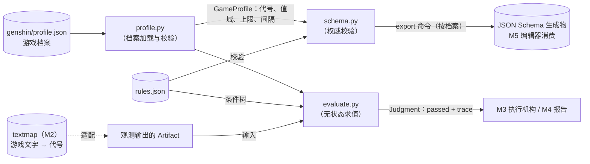

# M1 设计决策

对应 `proposal.md`；行为契约见 `specs/rule-file-format/spec.md` 与 `specs/judgment/spec.md`，此处只记录取舍。

## D1 运行时零第三方依赖

**选择**：`rule_lambda` 只用标准库；开发依赖仅 pytest 与 jsonschema，收在根目录 `requirements-dev.txt`。

**理由**：这个包最终跑在 MaaFramework agent 的 Python 环境里，运行时依赖越少，部署越不受 agent 环境约束；格式本身小，手写校验完全可控。

**否决**：pydantic——校验声明优雅，但给运行时环境引入依赖，换来的便利不值得。

## D2 导入方案：`agent.rule_lambda` + 空 `agent/__init__.py`

**选择**：`agent/` 加空 `__init__.py`，测试与外部一律 `import agent.rule_lambda...`；`python -m pytest` 从仓库根运行（cwd 入 sys.path，导入可用）。`agent/main.py` 的运行时接线推迟到 M3。

**理由**：不加 `__init__.py` 则包导入不可靠；`__init__.py` 保持空文件，保证导入 `agent.rule_lambda` 永远不会连带拉入 `maa` 包（现有 `agent/main.py` 导入 maa，这是 spec §12 的红线）。测试里用「导入后 maa 不在 sys.modules」做守卫。

**否决**：把 `rule_lambda` 提升为顶层 `src/` 包——spec §13 目录结构已定 `agent/rule_lambda/`，无必要偏离。

## D3 数据模型用 dataclass，配 `to_dict`/`from_dict`

**选择**：`Artifact` 与 `StatValue` 用 dataclass，手写 JSON 往返方法，键名与 spec §3 示例一致。

**理由**：报告（M4）要序列化模型，观测（M2）要构造模型，类型化字段比裸字典可靠；往返方法让「JSON 形状」有一处权威定义。

**否决**：纯字典（形状无保障）；pydantic（见 D1）。

## D4 手写校验为权威，JSON Schema 生成物保证等价

**选择**：`schema.py` 手写 `validate()` 是规则文件校验的权威实现；`export_json_schema()` 生成的 JSON Schema 是给 M5 编辑器的同源副本。运算符与字段类型的兼容规则（字符串字段仅 `==`/`!=`/`exists` 等）用 JSON Schema 的 `if/then` 条件约束表达。两者的等价性不靠约定，靠同一批合法/非法样本双端断言（任务 6.1）。

**理由**：spec §14 M1 验收明确要求「非法样例被生成物拒绝」，生成物必须接近全语义，不能只查结构。

**否决**：生成物只覆盖结构、语义留给各自实现——编辑器将放过非法规则，两端行为漂移没有兜底。

## D5 剩余强化次数：档案参数化并向上取整

**选择**：`remaining_rolls = ⌈(等级上限 − 等级) ÷ 词条变动间隔⌉`，参数取自游戏档案（原神为 ⌈(20 − 等级) ÷ 4⌉）。等级落在变动节点之间时（喂食经验可停在任意等级，如 +17）向上取整保证仍计一次变动（17 → 1）。

**理由**：spec 与 CONTEXT 原写法「等于 (20 − 等级) ÷ 4」隐含「等级总是 4 的倍数」假设，该假设不成立；同时多游戏架构（ADR-0004）要求上限与间隔不得硬编码。参数化与取整已随多游戏定案写入 spec §4 与 CONTEXT（2026-08-29）。

**否决**：字面除法（结果非整数，无法与整数阈值比较）；向下取整（+17 算 0 次，错）。

## D6 求值过程记录（trace）用纯字典树

**选择**：trace 是嵌套字典，节点形状见 `specs/judgment/spec.md`。

**理由**：trace 的唯一下游是运行报告（M4，直接 JSON 序列化）与调试阅读，纯字典零转换。

**否决**：dataclass——还要一层转 dict，无收益。

## D7 不校验「属性与部位/主副词条的合法性组合」

**选择**：schema 不拦截 `sub.healing_bonus`（治疗加成不会出现在副词条）这类组合。

**理由**：不可能的组合在求值时走「字段缺失 → 不通过」语义，天然安全；合法性矩阵（哪个属性能当主词条/副词条）是又一份数据，维护成本大于收益。

**否决**：完整合法性矩阵——YAGNI。

## D8 代号数量：16 个文字族，19 个字段代号；清单归档案所有

**选择**：字段对照文档按**文字族**收录 16 条（「生命值」一条）；原神档案的属性代号是 **19 个**——`hp/atk/def` 三族各拆固定值与百分比两个代号，其余一族一代号。代号清单是档案数据（ADR-0004），`schema.py` 校验时从加载的档案取枚举，代码零硬编码。

**理由**：OCR 先按数值后缀区分固定值与百分比，再落到具体代号（spec §4 既有语义）；文字族与字段代号是两个粒度，清单分别固化在 `specs/rule-file-format/spec.md`。

**否决**：文字族也拆两条对照（「生命值」与「生命值%」两条）——游戏界面不显示「生命值%」这种文字，后缀区分已经在做，无需重复。

## 模块关系

