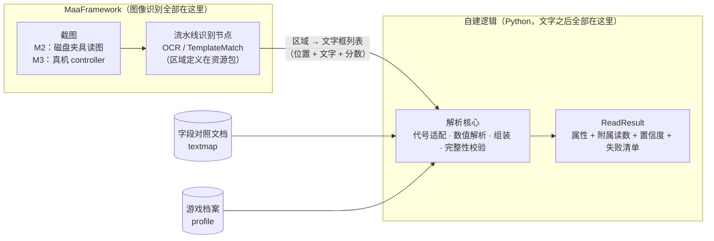

# M2 概念对齐文档：观测机构

> 性质说明：本文**不是**设计文档，是供需求方与开发方对齐 M2 的概念性文档——说明 M2 的设计目标、输入输出，以及「哪些环节交给 MaaFramework 流水线、哪些是自建逻辑」的职责分界。接口签名、节点参数、测试清单等设计细节在 M2 计划（proposal/tasks）中另行制定；本文内容若被静默偏离，即视为对齐失败。

## 1. 设计目标

一句话：**在不连接真机的前提下，证明「一张游戏截图进来，一个正确的圣遗物属性结构出来」**——识别质量与解析正确性都在离线状态验证。对应 spec §14 的 M2 验收「截图样本回放，字段解析断言全部通过」。

三个子目标：

1. **识别层验证**：框架的 OCR 与模板匹配，对两个界面（背包右栏、强化页右侧）的全部识别区域，能读出截图中的文字与图标。
2. **解析层验证**：识别出的文字经字段对照文档适配、数值解析、完整性校验，组装为合规的圣遗物属性对象（spec §3 数据模型）。
3. **职责分界固化**：图像识别全部走 MaaFramework 流水线；Python 自建逻辑只做「文字之后」的处理。分界清单见第 4 节。

## 2. 总体数据流



M2 与 M3 走**同一条流水线、同一个解析核心**，只差截图来源：M2 从磁盘夹具读图，M3 从真机截图。这保证 M2 的离线验证结论对运行时成立（同引擎、同模型、同区域定义）。

## 3. 输入与输出

### 3.1 解析核心（自建，纯 Python，禁止导入 maa）

**输入（三样）**：

| 输入 | 内容 | 来源 |
| --- | --- | --- |
| 识别结果集 | 区域名 → 文字框列表（每框 = 位置矩形 + 文字 + 分数）；星级、锁定区域为模板匹配命中 | 框架识别节点的返回 |
| 游戏档案 | GameProfile（代号清单、值域、上限） | M1 产物 `profile.py` |
| 字段对照文档 | 游戏文字 → 属性代号/部位代号 | M2 交付的加载器 |

**输出（ReadResult，一个整体）**：

| 字段 | 内容 |
| --- | --- |
| ok | 布尔；硬失败即 false |
| artifact | 圣遗物属性（spec §3 模型）；ok 时必有 |
| extras | 附属读数：等级内经验进度、本次强化摩拉、素材档位、面包屑指纹；只进报告，不参与判定 |
| confidences | 逐字段置信度（来源于框架 OCR 的分数） |
| failures | 硬失败清单（读取失败，上层走「重试 → 安全停止」分支） |
| warnings | 警告清单（只进报告，不拦截，如副词条行数与等级不一致） |

### 3.2 流水线识别节点（自建数据，框架执行）

- 交付物：两界面每个识别区域一个节点的流水线 JSON，放资源包 `assets/resource/pipeline/genshin/`；坐标从截图夹具在 720 短边坐标系标定。
- 区域 OCR 一律 `only_rec`（仅识别不检测）+ 精确 roi 为主方案；个别区域实测错位时对该区域退回检测模式（det 模型已在资源包 `model/ocr/`），属参数调优，不改变分界。
- 已知常见误识别用流水线的 `replace` 字段纠错；星级、锁定图标用 TemplateMatch。

### 3.3 字段对照文档

- 数据文件：`assets/resource/genshin/textmap/zh_cn.json`（16 个词条文字族 + 5 个部位名，格式契约见 spec §4，已定稿）。
- 加载校验器（纯 Python）：文档缺失、语言不符、映射到档案不存在的代号 → 立即停止。

### 3.4 测试夹具

| 夹具 | 内容 | 用途 |
| --- | --- | --- |
| 截图 | 7 张（遮挡 UID，1280×720，16:9） | 离线全链路测试 |
| 识别结果转储 | 从框架识别节点录制的「区域 → 文字框列表」JSON | 解析核心单元测试 |

## 4. 职责分界（本文核心）

| 环节 | 归属 | 说明 |
| --- | --- | --- |
| 截图获取 | 框架 | M3 真机 controller；M2 经 maa 绑定读磁盘夹具 |
| 截图分辨率统一 | 框架 | PI v2 默认缩放到短边 720，Python 不写任何缩放代码 |
| 每个区域的文字识别 | 框架 | 流水线 OCR 节点：roi、only_rec、expected、replace、阈值；模型取资源包 `model/ocr/` |
| 星级、锁定图标识别 | 框架 | TemplateMatch 节点 |
| 识别结果的排序与选取 | 框架 | order_by / index / expected 配置 |
| 区域编排（逐区域调用、汇总） | 自建 | M3 为 ReadArtifact 自定义识别；M2 走离线等价路径 |
| 文字 → 属性代号 | 自建 | 字段对照文档适配 |
| 数值解析 | 自建 | 复用 M1 的解析函数（先去空白、字符白名单） |
| 组装属性与附属读数 | 自建 | 输出 spec §3 模型 + extras |
| 完整性校验、置信度、失败清单 | 自建 | 硬失败与警告的分界见定案（必要字段缺失/解析异常/行数超上限 → 硬失败；行数与等级一致性 → 警告） |
| 界面导航、点击、等待、重试 | 框架 | 流水线动作（M3/M4 落地） |
| 语言锚点、放入设置自检 | 自建发起 | OCR 读固定文字后比对（M3 落地） |

一条原则：**「图像变成文字和框」全部在框架；「文字和框变成结构化属性」全部在自建。**

## 5. M2 做与不做

**做**：第 3 节全部四项交付物 + 区域坐标标定 + 两层测试。

**不做（后续里程碑）**：ReadArtifact 注册与真机截图（M3）；导航、点击、放入狗粮（M3/M4）；语言锚点与放入设置自检（M3）；运行报告（M4）；其他游戏的区域标定（各游戏立项时）。

## 6. 测试的两层结构

| 层 | 输入 | 依赖 | 验证什么 |
| --- | --- | --- | --- |
| 第一层：解析核心单元测试 | 识别结果转储 + 档案 + 对照文档 | 纯 Python（maa-free） | 代号适配、数值解析、组装、缺失语义、完整性分界、重复代号与全角字符两项遗留定夺 |
| 第二层：离线全链路测试 | 截图夹具 | maa 绑定（开发依赖，钉版本） | 识别质量、坐标标定、端到端断言 |

两层用同一批截图夹具；第二层跑的框架识别与运行时完全一致（同引擎、同模型、同节点定义）。

## 7. 与既有决策的关系

- **ADR-0004（配置驱动多游戏）**：识别区域节点定义、OCR 模型、字段对照文档全在资源包；换游戏 = 新区域标定 + 新档案 + 新对照文档，代码零改动。
- **ADR-0005（单一布尔、场景无感知）**：两个读取器输出同一数据模型，仅区域集不同。
- **M1 零依赖原则（design.md D1）的适用范围澄清**：决策机构的运行时零第三方依赖不变；观测侧自建逻辑同样不引入推理库——推理由框架承担；maa 绑定只出现在开发依赖（离线回放）与 agent 运行时（本就存在）。
- **待核实项**：`run_recognition` 返回结构等细节出自框架 main 分支绑定源码（本地文档未覆盖），M2 落地时须对 MFAAvalonia 实际打包的框架版本核对一次。

## 8. 初步目录示意（精确命名在 M2 计划中定）

```
agent/
  observe.py              # 解析核心（自建，禁止导入 maa）—— M2
  observe_reco.py         # ReadArtifact 接线层（导入 maa 的很薄一层）—— M3
assets/resource/genshin/
  pipeline/…              # 观测识别节点定义（M2）+ 导航流水线（M3）
  model/ocr/              # PP-OCRv6 模型（已就位）
  textmap/zh_cn.json      # 字段对照文档数据（M2）
  profile.json            # 游戏档案（M1 已交付）
test/fixtures/
  screenshots/            # 截图夹具（遮挡 UID）
  ocr_dumps/              # 识别结果转储
```
