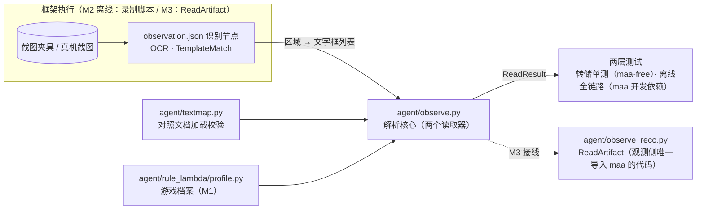

# M2 设计决策

对应 `proposal.md`；行为契约见 `specs/observation/spec.md`，概念与职责分界见 `concept.md`（上游约束），此处只记录取舍。

## D1 图像识别全部框架化，自建侧零推理

**选择**：OCR 与图标识别全部由流水线节点执行（模型取资源包 `model/ocr/`）；自建侧不引入 onnxruntime 等任何推理库；观测侧导入 maa 的只有 M3 接线层 `observe_reco.py`。

**理由**：框架 OCR 能力完备（`only_rec`、`expected`、`replace`、`color_filter`、全量结果框可取），且 `post_recognition` 支持对磁盘图像离线执行——M2 能用与运行时完全相同的引擎做验证；离线可验这一原属自管推理的优势，经研究证实框架同样具备。

**否决**：Python 自管 onnxruntime 推理——优势不成立，多一个运行时依赖反而劣化部署（2026-08-29 需求方定案）。

## D2 解析核心以「区域键」为契约，不感知流水线节点名

**选择**：解析核心输入字典的键是稳定的区域名（如 `level`、`substats`、`stars`）；流水线节点命名（`obs_<reader>_<region>`）与节点名到区域键的映射，由离线录制脚本与 M3 接线层负责。

**理由**：离线（转储、录制脚本）与在线（ReadArtifact）同构；调整节点命名不动解析核心契约。

## D3 强化页读取器接收沿用字段入参，输出完整 Artifact

**选择**：`read_enhance(recognition, carried, profile, textmap)`，`CarriedFields(rarity, set, locked)` 由控制层从列表初扫传递；合并发生在解析核心边界内。

**理由**：ReadResult 形状对两个读取器完全统一；解析核心保持纯函数；ADR-0005 字段分工的直接落地。

**否决**：强化页读取器返回残缺对象、控制层事后拼装——ReadResult 出现两种形状，消费方分支变多。

## D4 区域 OCR 一律 only_rec 优先

**选择**：固定行槽 + `only_rec: true` + 精确 roi；个别区域实测错位再对该区域退回检测模式（det 模型已在资源包）。

**理由**：更快更稳（跳过检测网络）；退回是节点参数调优，不改变架构与分界。

## D5 未收录文字的精确语义

**选择**：词条名未收录对照文档 → 名称按 OCR 原文存入 + 警告（无代号可匹配，判定天然不通过，安全方向）；部位名未收录 → 读取失败（走重试 → 安全停止分支）。

**理由**：spec §6「不中断运行」的意图是不因未知文字崩溃整个运行——读取失败 → 跳过该候选正是「不中断」的落地形态。词条名存原文是安全的：原文永远不会再被任何属性代号匹配到。

**否决**：未知部位也存原文——`validate_artifact` 会拒绝部位，等价于读取失败，不如显式归入失败清单、语义一致。

## D6 转储夹具 = 真实录制 + 手工构造异常

**选择**：7 张截图经录制脚本产生真实转储入库；识别为空、低置信度、文字畸形（如「暴击率+3.I%」）等异常转储手工构造。

**理由**：真实转储验证「正常世界」，构造转储验证「异常世界」，缺一不可。

## D7 夹具统一 1280×720

**选择**：`prepare_fixtures.py` 把任意 16:9 截图缩放到 1280×720 后涂黑 UID 角再入库；区域坐标标定与夹具同一坐标系。

**理由**：与框架「短边 720」的运行时契约完全一致；标定时所见即运行时所得。

## D8 maa 开发依赖钉版本

**选择**：`requirements-dev.txt` 钉 maa 具体版本；任务 1.1 对照 MFAAvalonia 发布说明核对打包的框架版本并记入 log。

**理由**：离线回放引擎与运行时引擎的版本偏移是隐形风险；钉住才可复现。

## 模块关系

