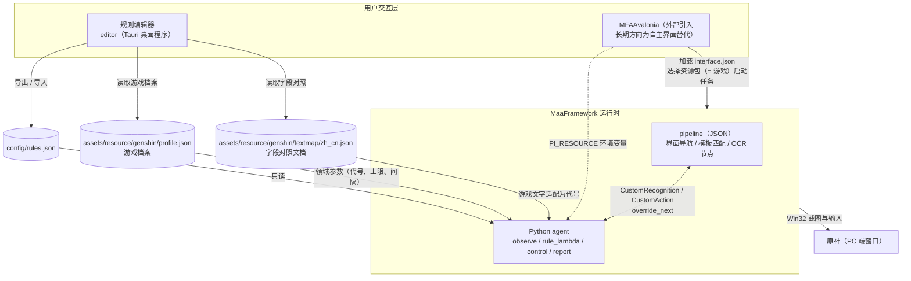
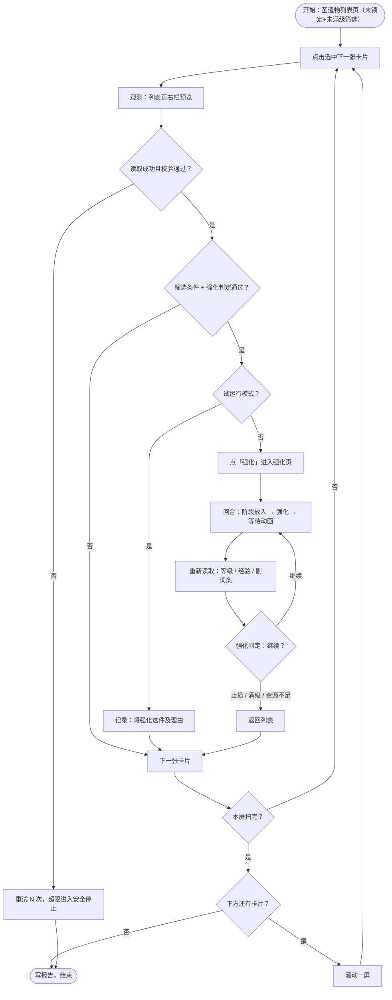

# Auto-Grade-Up 设计文档

- 日期：2026-08-28，2026-08-29 修订
- 状态：已与需求方逐节评审通过；游戏界面事实以 `reference/pic/` 目录下的截图为唯一真相来源
- 方法：brainstorming（architectural 路径）+ 逐轮评审

## 0. 已确认的需求决策

| 决策点 | 结论 |
| --- | --- |
| 工作流范围 | 全自动批量强化：扫描圣遗物背包，逐件读取、判定、强化，直到扫完或资源耗尽 |
| 运行平台 | PC 端原神，Win32 窗口控制 |
| 强化策略 | 逐回合判定：每回合（阶段放入 + 强化）恰好覆盖一个词条变动点，重新读取属性后判定继续或止损 |
| 判定模型 | 单一规则集：同一棵条件树既决定是否开始强化，也决定是否继续强化，配合「剩余强化次数」字段区分阶段；决策机构不保存历史状态（ADR-0003） |
| 规则编辑 | 独立规则编辑器（Tauri 桌面程序：网页界面 + 原生外壳，见 ADR-0002），规则保存为 JSON，支持导入导出 |
| 与 MFA 的关系 | MFAAvalonia 不支持自定义页面与插件（见 §9），运行器当前直接使用 MFAAvalonia，编辑器通过规则 JSON 文件与其解耦；长期方向为自主实现完整界面、替代 MFAAvalonia（ADR-0002） |
| 规则存储结构 | 结构化条件树（并且组/或者组 + 叶子条件），存储即 JSON；规则文件带游戏标识（game 字段），与当前游戏档案不符立即停止 |
| 字段命名 | 条件树内字段使用英文代号，代号清单由游戏档案定义；游戏文字经字段对照文档适配为代号（收录词条名与部位名，第一版仅中文，多语言预留），文档已定稿见 §4 |
| 狗粮来源 | 强化页「阶段放入」，素材档位下拉由用户预设；5 星素材被游戏开关默认排除；不做狗粮星级校验 |
| 候选范围 | 可配置过滤，默认仅未锁定且未满级；默认星级 [5] |
| 扫描前提 | 用户预先筛选「未锁定」+「未满级」，排序设为「等级顺序 + 升序」（图3、图6、图7 确认可行） |
| 单件任务 | 跳过筛选条件，直接进入逐回合判定；启动校验剩余强化次数，首次放入前先做一次强化判定，锁定不拦截 |
| 多规则集 | 第一版单套规则；多套需求用多个规则文件切换 |
| 规则可引用字段 | 部位、星级、套装、等级、主词条、全部副词条、副词条条数、剩余强化次数 |
| 运行记录 | 日志 + 结构化报告（JSON + Markdown 摘要） |
| 试运行 | 第一版即提供试运行（dry-run）：只扫描与判定，不实际消耗 |
| 多游戏支持 | 架构就绪、第一版仅原神：游戏差异（属性代号、部位代号、等级上限、词条变动间隔、星级范围、副词条上限、回合机制）收进游戏档案，全部机构共用代码（ADR-0004） |
| 游戏选中机制 | 运行器中选择资源包即选择游戏；agent 读 PI_RESOURCE 环境变量（PI v2.5.0 约定，MFAAvalonia 已实现）获知选中资源包，在其路径内查找游戏档案；变量缺失立即停止（见 §9） |

## 1. 概述

Auto-Grade-Up 是一个基于 [MaaFramework](https://github.com/MaaXYZ/MaaFramework) 的圣遗物自动强化工具，第一版支持原神。「圣遗物」在本工具中是跨游戏统称：星穹铁道的遗器、绝区零的驱动盘，在文档、界面与代码中均称圣遗物（术语定义见 CONTEXT.md）。它遍历游戏内圣遗物背包，用 OCR（光学字符识别）读取每件圣遗物的完整属性，按用户自定义规则决定是否强化、是否继续强化，并通过模拟点击完成整个强化流程。架构面向米哈游系多游戏：游戏差异（代号、部位、等级上限等）收进游戏档案、随资源包分发，各机构共用代码（ADR-0004）；星穹铁道、绝区零为预留方向，第一版不交付。

**非目标**（明确不做）：

- 圣遗物弃置、出售等不可逆清理操作（狗粮消耗除外，且由游戏锁定机制保护）。
- 圣遗物配装建议、评分排行。
- 移动端、云原神。
- 第一版不做多语言界面（仅中文）；游戏客户端仅支持简体中文，多语言由字段对照文档预留。
- 星穹铁道、绝区零等其他游戏的第一版交付（多游戏为架构预留，各游戏界面事实未研究，见 ADR-0004）。

## 2. 总体架构



| 组件 | 位置 | 职责 |
| --- | --- | --- |
| 运行器 | MFAAvalonia（外部） | 连接游戏窗口、启动任务、展示日志 |
| 导航流水线 | `assets/resource/pipeline/` | 界面流程：模板匹配找按钮、OCR 定位、等待动画 |
| 观测机构 | `agent/observe.py` | 在截图上做多区域 OCR，输出结构化的圣遗物属性 |
| 游戏档案 | `assets/resource/<游戏>/profile.json` | 声明该游戏的代号清单、部位、等级上限、词条变动间隔等参数；各机构共用代码的数据源 |
| 决策机构 | `agent/rule_lambda/`（模块名） | 加载并校验游戏档案与规则文件、对条件树求值、输出判定结果与求值过程记录 |
| 执行机构 | `agent/control.py` + pipeline | 批量遍历控制、放入狗粮、强化点击、身份核对 |
| 报告 | `agent/report.py` | 汇总运行记录，输出 JSON 与 Markdown |
| 规则编辑器 | `editor/`（Tauri 桌面程序） | 条件树的可视化编辑，读写规则 JSON 与字段对照文档 |

依赖方向单向：`control → rule_lambda →（数据模型）`，`observe →（数据模型）`。决策与观测互不依赖；`rule_lambda` 与数据模型不引入 `maa` 包，可以在没有 MaaFramework 的环境下独立做单元测试。

## 3. 圣遗物数据模型

观测机构的输出、决策机构的输入，唯一数据模型如下：

```jsonc
{
  "slot": "sands",             // flower / plume / sands / goblet / circlet
  "rarity": 5,
  "set": "辰砂往生录",          // 套装名保留游戏原文，见 §4
  "level": 4,                  // 0..20
  "locked": false,
  "main": { "name": "atk_percent", "value": 31.5 },
  "substats": [
    { "name": "crit_rate", "value": 5.8 },
    { "name": "atk", "value": 117 }
  ]
}
```

解析约定：

- 词条名经字段对照文档适配为属性代号后入模型（见 §4）；OCR 文字先去除空白再查对照（OCR 可能引入空格差异）。
- 固定值与百分比是两个代号（如 `atk` 与 `atk_percent`），由 OCR 按数值后缀的 `%` 区分，模型内不另存是否百分比的标记。
- 词条数值按游戏显示值存储（如攻击力 298、暴击率 5.8），主副词条一律如此。
- 套装名保留游戏原文，不经对照文档（取舍见 §4 收录范围）。
- 「剩余强化次数」不入模型：决策机构求值时由等级与档案参数推导（见 §4）。
- 值域校验（等级 0..上限、星级范围、部位代号、副词条上限）由游戏档案驱动，独立于模型形状；原神档案为 0..20、1~5 星、5 部位、4 条。

## 4. 规则文件（config/rules.json）

规则文件是编辑器与决策机构之间的唯一契约。完整示例：

```jsonc
{
  "version": 1,
  "game": "genshin",             // 游戏标识，与当前游戏档案不符立即停止
  "name": "默认双爆规则",
  "candidates": {
    "rarity": [5],             // 默认仅 5 星，防止误操作；[] 表示不限
    "slots": [],               // [] 表示不限；如 ["sands"]
    "max_level": 20,           // 仅处理等级低于 max_level 的圣遗物
    "respect_lock": true       // 锁定的圣遗物绝不处理
  },
  "rule": {                    // 强化判定：开始强化与继续强化共用这一棵条件树
    "all": [
      { "any": [
        { "field": "sub.crit_dmg", "op": ">=", "value": 15 },
        { "all": [
          { "field": "sub.crit_rate", "op": ">=", "value": 8 },
          { "field": "remaining_rolls", "op": ">=", "value": 3 }
        ] }
      ] }
    ]
  },
  "fodder": {
    "strategy": "staged_fill", // 第一版仅支持游戏「阶段放入」
    "respect_lock": true       // 声明性字段，游戏机制保证，编辑器不开放修改
  }
}
```

示例规则的含义：暴击伤害已到 15 则继续强化；否则要求暴击率不低于 8 且剩余强化次数不少于 3，给成长早期的圣遗物留出机会。

条件树结构：

| 节点 | 结构 | 语义 |
| --- | --- | --- |
| 并且组 | `{"all": [子节点...]}` | 所有子节点通过才通过；空数组视为通过 |
| 或者组 | `{"any": [子节点...]}` | 任一子节点通过即通过；空数组视为不通过 |
| 叶子 | `{"field", "op", "value"}` 或 `{"field", "op": "exists"}` | 单个条件 |

叶子运算符：`> < >= <= == != exists`（exists 为存在判断，例如「有暴击率副词条」）。数值字段支持全部比较运算符；字符串字段（部位、套装）只支持相等（`==`）、不相等（`!=`）与存在判断；「包含」运算符预留位置，等套装名识别精度实测后再决定是否启用。

字段命名空间（条件树内字段一律使用英文代号——解析稳定、避免编码歧义，并消除「生命值」固定值与百分比同名的歧义）：

| 字段 | 类型 | 说明 |
| --- | --- | --- |
| `level` | number | 当前等级 |
| `rarity` | number | 星级 |
| `slot` | string | 部位 |
| `set` | string | 套装名 |
| `remaining_rolls` | number | 剩余强化次数：从当前等级到等级上限还会发生的词条变动次数，等于 ⌈(等级上限 − 等级) ÷ 词条变动间隔⌉（向上取整——等级可能停在非节点上，如 +17 到 +20 仍有一次变动），参数取自游戏档案（原神为 ⌈(20 − 等级) ÷ 4⌉），由等级推导 |
| `substat_count` | number | 副词条条数（0 ~ 副词条上限，由档案声明，原神为 4） |
| `main.<属性代号>` | number | 主词条数值（显示单位） |
| `sub.<属性代号>` | number | 副词条数值（显示单位）；不存在时数值比较一律不通过，可用 exists 显式判断 |

属性代号由游戏档案定义（格式定义固化档案结构，见下文「游戏档案」）。原神档案的常用代号：`crit_rate`（暴击率）、`crit_dmg`（暴击伤害）、`hp` / `hp_percent`（生命值）、`atk` / `atk_percent`（攻击力）、`def` / `def_percent`（防御力）、`elemental_mastery`（元素精通）、`energy_recharge`（元素充能效率）、`healing_bonus`（治疗加成）、`physical_dmg_bonus`（物理伤害加成）、各元素伤害加成。完整清单见原神档案；代号与游戏文字的对应关系由字段对照文档定义（见下）。

**游戏档案**：声明一个游戏的领域参数——属性代号清单、部位代号清单、等级上限、词条变动间隔、星级范围、副词条上限、回合机制声明（如 `staged_fill`）。存放于资源包根目录（原神为 `assets/resource/genshin/profile.json`），interface.json 的每个资源包（=游戏）一份；决策机构、编辑器与报告以它为字段与值域的唯一来源，代码不硬编码任何游戏数值。档案缺失、结构不符或 `round_mechanism` 声明了代码不认识的回合机制 → 立即停止并提示（与规则文件同一纪律）。第一版仅随包维护原神档案；星穹铁道、绝区零为架构预留，各游戏立项时另行补档案与真机研究（ADR-0004）。

**字段对照文档**：游戏界面文字与内部代号之间的对照，独立成文档维护（不内嵌在规则文件里）。它同时是观测机构的适配层——OCR 读到的游戏文字经它转换为内部代号，使规则字段与游戏语言无关（套装名按原文比较，是第一版的例外）；对照文档按游戏语言各维护一份，第一版仅维护简体中文，多语言为预留能力。工具内部自算的字段（如 `remaining_rolls`）由代码定义，不入对照文档。已定稿内容：

- 位置与命名：`assets/resource/genshin/textmap/zh_cn.json`，随该游戏的资源包分发，按游戏与语言各一份、以语言代码命名。
- 收录范围（第一版）：词条名（约 16 条属性族）与部位名（5 条）。套装名与圣遗物名不收录——`set` 字段值为游戏原文，指纹核对在同一次运行内自比较，都不依赖对照文档。
- 格式：文字到代号的单向映射，反向显示由读取方推导。

```jsonc
{
  "version": 1,
  "language": "zh_cn",
  "stats": {
    // 词条名 → 属性族代号；固定值与百分比共用一条，
    // OCR 先按数值后缀的 % 区分，再落到 sub.hp / sub.hp_percent 等字段
    "暴击率": "crit_rate",
    "暴击伤害": "crit_dmg",
    "生命值": "hp",
    "攻击力": "atk",
    "防御力": "def",
    "元素精通": "elemental_mastery",
    "元素充能效率": "energy_recharge",
    "治疗加成": "healing_bonus",
    "物理伤害加成": "physical_dmg_bonus",
    "火元素伤害加成": "pyro_dmg_bonus"
    // 水/雷/冰/风/岩/草元素伤害加成各一条，共 16 条
  },
  "slots": {
    "生之花": "flower",
    "死之羽": "plume",
    "时之沙": "sands",
    "空之杯": "goblet",
    "理之冠": "circlet"
  }
}
```

- 加载与校验语义：代号枚举固化在游戏档案中，对照文档把文字映射到这些代号。文档缺失、语言不符或映射到档案中不存在的代号 → 立即停止并提示（与规则文件同一纪律；语言不符由启动自检的锚点文字识别发现，见 §7）；观测读到文档未收录的文字 → 该字段记为未知值并写入报告警告，该字段判定按不通过处理，不中断整个运行。

**判定执行时机**：强化判定在两个时机执行，输入相同、规则相同——列表扫描时（决定是否开始强化）、每个强化回合结束后（决定是否继续）。判定每次现场计算：止损的圣遗物再次被扫到时，判定结果仍然是不通过，自然被跳过。因此决策机构不需要记录任何历史状态，同一套规则适用于任意强化阶段。

版本与校验：`version` 字段标识规则文件的格式版本，`game` 字段标识所属游戏（运行时与当前游戏档案比对，不符立即停止）；编辑器与 `rule_lambda` 各自内置同一份格式定义做校验，解析或校验失败一律立即停止任务并提示（不回退到默认规则，避免用错误规则执行消耗性操作）。属性代号与部位代号由游戏档案统一管理：决策机构运行时从资源包加载档案，编辑器直接读取资源包内的档案与对照文档（无副本）；JSON Schema 生成物按档案导出（见 §8），两端一致性由校验兜底。

**字段类型系统已定案（2026-08-29）**：英文代号字段、副词条条数字段、字符串字段运算符（相等/不相等/存在，包含预留）、存在判断运算符。**字段对照文档已定稿（2026-08-29）**：位置、收录范围、格式与加载语义见上，M2 的阻塞项清除。**多游戏架构已定案（2026-08-29）**：游戏档案 + 资源包即游戏 + 各机构共用代码（ADR-0004），档案格式随 M1 落地。

## 5. 决策机构（agent/rule_lambda）

纯 Python 库，不引入 MaaFramework：

- `model.py`：数据模型与 OCR 文本解析。
- `profile.py`：游戏档案的加载与校验。
- `schema.py`：规则文件校验（结构、字段名、运算符合法性；代号与值域取自游戏档案）。
- `evaluate.py`：条件树求值，返回判定结果与求值过程记录（trace），trace 写入运行报告，保证每个决策可解释（为什么强化、为什么止损）。

求值语义：字段不存在时数值比较不通过，可用 exists 显式处理；等级、星级等标量字段始终存在；剩余强化次数由等级与档案参数推导，始终存在。决策机构不保存任何跨圣遗物的历史状态。

## 6. 观测机构（agent/observe.py）

观测机构按界面提供两个读取器，共用同一自定义识别框架（`ReadArtifact`）：单次截图，多个识别区域并行处理，产出圣遗物属性与逐字段置信度。两个观测点的目的相同——获取词条与属性，输出统一的数据模型（§3）；列表页的读数同时服务筛选条件与强化判定，强化页的读数只服务判定。识别区域与文字格式随界面不同（原神界面事实，以 `reference/pic/` 与 `reference/pic2/` 截图为真相来源；新游戏立项时重新标定）：

**列表页右栏预览**（初扫判定用，图1/图3）——包含判定所需全部字段，观测不需要打开详情页：

| 识别区域 | 内容 | 手段 |
| --- | --- | --- |
| 预览栏标题区 | 圣遗物名、部位 | OCR |
| 主词条区 | 主词条名 + 数值 | OCR |
| 等级徽标 | 当前等级（如 +19） | OCR |
| 副词条列表 | 逐行「词条名+数值」（如「暴击率+3.1%」，带加号前缀） | OCR |
| 套装名行 | 套装名（绿色文字行，如「黄金剧团：」；其下的套装效果文字不读） | OCR |
| 星标行 | 星级 | 星星图标模板匹配（1~5 档） |
| 锁定图标 | 锁定状态 | 模板匹配（核对用，正常已被筛选排除） |

**强化页右侧**（回合中重新读取用，图2/图4/图5）：

| 识别区域 | 内容 | 手段 |
| --- | --- | --- |
| 面包屑（页面左上角的位置指示文字） | 部位 / 圣遗物名 | OCR |
| 等级与经验 | 当前等级、当前等级内的经验进度（如 2900/35575） | OCR |
| 主词条区 | 主词条名 + 数值（名左值右，如「攻击力 298」） | OCR |
| 副词条列表 | 逐行「词条名 数值」（名左值右，无加号前缀，如「暴击率 3.1%」）；旁侧的强化次数标记 ①②③ 不进数据模型，解析时忽略（可作解析结果的交叉校验） | OCR |
| 摩拉区 | 本次需要摩拉数、右上角摩拉余额 | OCR |
| 素材档位下拉 | 当前档位文字（只记录进报告，不拦截） | OCR |

**回合判定输入的字段分工**：两个读取器输出同一种数据模型，两处判定使用完全相同的输入形状。强化页读取器现场读取等级、主词条、副词条与部位（面包屑可见「部位 / 圣遗物名」）；星级、套装名、锁定状态在强化页不显示，且在单件强化过程中不可能变化，沿用列表初扫读数，由控制层传递。

可靠性设计：

- OCR 读到的词条名、部位名经字段对照文档适配为内部代号（见 §4，对照文档与游戏档案随游戏资源包分发），套装名等其余文字按原文使用；对照文档未收录的文字记为未知值并写入报告警告，该字段判定按不通过处理，不中断运行。
- 完整性校验不通过（副词条行数与等级明显不符、等级或星级解析失败、必要字段缺失）→ 返回失败，上层进入安全分支，绝不带着残缺数据做消耗性决策。
- 所有 OCR 原文与调试截图保存到 `debug/` 目录（已在 .gitignore），便于精度排查。
- 小字号数字识别不达标时，升级方案为更换更大档位的 rec 模型，或对数字区域做放大预处理。

识别区域坐标一律在 720 短边坐标系标定，使用 VSCode 的 Maa Pipeline Support 插件截图取点。

## 7. 执行机构与批量流程



驱动方式（混合方案）：单件回合循环（阶段放入 → 强化 → 等待动画 → 重新读取 → 判定）由 pipeline 表达，享受模板匹配自带的等待与重试机制；批量遍历（选卡、滚动、终止）由 `agent/control.py` 的批量控制逻辑驱动，两者以 `override_next` 衔接。

**判定结果的用法**：决策机构输出单一的「是否强化」布尔值，对场景无感知（ADR-0005）；执行机构按「布尔值 + 当前界面」映射为四种操作——列表页：通过 → 进入强化页并强化一次，不通过 → 跳到下一张卡片；强化页：通过 → 再进行一次强化，不通过 → 返回列表后移动到下一张卡片。界面知识由执行机构持有——导航本身由它执行。

界面事实与扫描约定（原神；依据 `reference/pic/` 截图。新游戏立项时逐条重新核实，含指纹核对所依赖的「圣遗物名唯一对应套装与部位」假设）：

- **使用前提（第一版强制）**：用户预先在圣遗物筛选面板勾选「未锁定」+「未满级」（图3），列表中因此不会出现锁定与满级的圣遗物；排序设为「等级顺序 + 升序」（图6/图7，辅助排序规则含等级顺序，排序方式含升序与降序），等级低、强化成本低的圣遗物先被处理。工具不代替用户操作筛选与排序。
- 启动自检：批量任务要求当前处于圣遗物列表页，单件任务要求处于圣遗物详情页；界面特征不符则立即停止并提示，不做自动导航。自检同时核对语言锚点（OCR 列表页左上角「圣遗物」等固定中文文字），识别不符视为客户端语言不受支持，立即停止；并核对「放入设置」（图5）：「开启阶段放入功能」须为开启、「可快捷放入5星圣遗物作为强化素材」须为关闭，不符立即停止并提示。
- **单件任务语义**：启动时读取等级，剩余强化次数为 0（已满级）→ 提示并结束，不做任何消耗；进入强化页后、首次阶段放入之前，先用强化页右侧区域读取并做一次强化判定，不通过 → 提示并返回（判定先于任何消耗，与批量的「判定通过才进入强化页」一致）；锁定状态不拦截（锁定只防狗粮误耗），使用文档写明。
- 遍历方式：卡片网格不支持键盘移动选中，只能鼠标逐张点击；自上而下、自左而右逐张点击，读取右栏预览并判定；一屏扫完滚动一屏，直到列表末尾。
- **重复扫到不做去重**：滚动一屏后上屏卡片可能残留，同一件圣遗物会被再次读取与判定；此时按当前属性现场判定，控制层不维护「已处理」清单——已强化的圣遗物等级与副词条已变，判定结果自然反映强化进度（见 ADR-0003）。
- **回合循环不离开强化页**：强化动画结束后停在强化页。回合 =「阶段放入 → 强化 → 等待动画 → 重新读取」，仅止损、满级、资源不足时点返回回列表。
- **阶段放入语义（原神机制；游戏档案以 `round_mechanism: "staged_fill"` 声明，代码遇到未声明的回合机制立即停止）**：需开启「放入设置 → 开启阶段放入功能」（图5）；放入量止步于下一个 4/8/12/16/20 级节点，即**每回合恰好覆盖一个词条变动点**（+4/+8/+12/+16/+20；0→4 段的 3 词条圣遗物在此解锁第 4 条副词条，16→20 段同样覆盖一次词条变动）。图5 游戏说明原文仅列「4/8/12/16 级」，16→20 段是否同样止步以 M3 真机复核为准（判定循环对两种行为都稳健：每次强化后都重新读取并判定）。
- 「可快捷放入5星圣遗物作为强化素材」开关默认关闭（图5），默认最多消耗到未锁定 4 星素材；素材档位下拉（1星 / 2星及以下 / 3星及以下 / 4星及以下，图4）的当前档位每回合读取并记录进报告（只记录，不拦截）。

狗粮策略（第一版，原神）：

- 强化页「阶段放入」放入狗粮，素材档位下拉与「放入设置」由用户在游戏内预先设置；锁定圣遗物被游戏机制天然排除，5 星素材被默认关闭的开关排除。
- 「把不想喂的圣遗物提前锁定」作为安全提示写入使用文档。
- 明确不做狗粮星级校验（2026-08-28 评审决策）；强化前校验「经验与摩拉足够」，两者在强化页都有直接可读的显示。
- 报告如实记录每回合的等级跨度与强化次数标记变化。

安全红线：

- 一切消耗性操作之前，用强化页面包屑的「部位 / 圣遗物名」加等级构成指纹（圣遗物名唯一对应套装与部位），与上一次观测（列表初读或上一回合读取）的指纹比较，不一致立即停止。
- 摩拉不足（强化页直接可读）→ 整体停止并写报告；素材不足以到达下一个词条变动点（阶段放入后强化按钮不可用）→ 跳过这件，继续下一件。
- 弃置、出售等不可逆操作不在功能范围内。

## 8. 规则编辑器（editor/，Tauri 桌面程序）

技术选型：Tauri——网页界面（HTML/CSS/JavaScript）加原生外壳（ADR-0002）。原生读写本地文件，直接打开规则文件与资源目录里的字段对照文档，没有浏览器安全限制；打包体积小；目标平台仅 Windows（由游戏端决定）。

功能清单：

- 条件树可视化编辑：添加、删除、嵌套并且组/或者组/叶子节点；叶子提供字段下拉（字段与代号清单来自游戏档案，按字段对照文档显示中文名称，存入规则文件的是英文代号）、运算符下拉、数值输入。
- 筛选条件与狗粮配置表单。
- 导入、导出 rules.json（支持拖拽导入与文件选择）。
- 内置格式校验，非法配置给出定位到节点的错误提示。
- 当前规则的人类可读预览文字（用于确认规则含义）。
- 中文界面。

格式定义的同源方式：决策机构 `schema.py` 提供导出命令，按一份游戏档案生成 JSON Schema 生成物（结构 + 该档案的代号枚举）到 `editor/src/generated/`，编辑器构建时消费；生成物不手工编辑——修改格式或档案数据时先改 Python 侧或档案，再重新导出（第一版默认读原神档案路径，多游戏时由构建脚本逐档案导出）。游戏档案与字段对照文档由编辑器直接读取资源目录文件，无副本；首次使用时设置一次路径（默认指向资源目录）。

「试规则」功能（在编辑器内粘贴圣遗物样例、即时查看判定结果）第一版不做（2026-08-28 评审决策），规则试跑由测试样例与试运行承担，列为后续版本候选；若调参成为高频场景，可提前到 M5 一并实现。

## 9. interface.json 与 MFAAvalonia

MFAAvalonia 调研结论（2026-08）：它是纯声明式界面，只渲染 interface.json 里声明的任务与选项（下拉、多选、输入框、快捷键、开关），**没有插件系统、自定义页面或内嵌网页容器**，无法承载规则编辑器；复制改造它的成本不成比例。因此采用「编辑器独立、规则文件解耦」：

- 运行器：直接使用 MFAAvalonia，本项目只维护 interface.json 与资源包。
- 资源包即游戏：interface.json 的 `resource[]` 每个游戏一条（第一版仅「原神」一条，含官服素材；后续星穹铁道、绝区零各一条），任务用 `resource` 字段过滤到对应资源包，用户选择了某个资源包时只看到适配它的任务。
- 游戏选中注入：agent 子进程读取 `PI_RESOURCE` 环境变量（ProjectInterface v2.5.0 约定：Client 启动 agent 时注入当前选中资源包的 JSON 快照，含 path 数组；MFAAvalonia 已实现该注入，经其 AgentHelper.cs 源码证实）→ 在资源包路径内定位游戏档案并加载；变量缺失或档案定位失败 → 立即停止并提示。M3 真机实测注入行为；若使用的 Client 不实现该约定，回退方案为自研 GUI（ADR-0002 长期方向的提前触发）。
- 任务入口：interface.json 声明两个任务——「批量强化」（圣遗物列表页启动）与「单件强化」（圣遗物详情页启动）。
- 规则传递：interface.json 提供 `input` 类型选项「规则文件路径」（带格式校验），取值经 `pipeline_override` 的模板替换注入任务入口节点的 `custom_action_param` / `custom_recognition_param`（协议确认这两个字段接受任意类型）；未填写时，决策机构使用默认路径 `config/rules.json`（相对 interface.json 目录，该目录已被 .gitignore 排除）。
- 其余选项：「摩拉下限」（输入框，低于下限即整体停止）、「狗粮策略」（下拉，第一版仅有阶段放入）。

controller：Win32，`window_regex: "原神|Genshin"`；截图与输入方式（PrintWindow、PostMessage 系列、Seize）按 MaaFramework 控制方式文档真机实测后选定。资源包第一版仅原神一份（多游戏时每游戏一条 resource 条目，见上）。发布物（README 与使用文档）需包含模拟输入类工具的账号风险免责声明。长期方向为自主实现完整图形界面并替代 MFAAvalonia（见 ADR-0002），届时本节的集成方式随 interface.json 一并替换。

## 10. 报告与试运行

每次运行在 `logs/` 目录产出：

- `report-<时间戳>.json`：结构化全量记录。
- `report-<时间戳>.md`：人类可读摘要（处理件数、强化件数、消耗、异常）。

JSON 结构（示意）：

```jsonc
{
  "dry_run": false,
  "game": "genshin",
  "rules_name": "默认双爆规则",
  "artifacts": [
    {
      "before": { },            // 圣遗物属性快照
      "after": { },
      "levels_gained": 12,
      "rounds": [ { "level": 8, "changed": ["crit_dmg +6.2%"] } ],
      "decisions": [
        { "at_level": 4, "action": "enhance", "trace": { } }  // 强化判定的求值过程记录
      ]
    }
  ],
  "summary": { "scanned": 87, "enhanced": 9, "stopped_reason": "mora_exhausted" }
}
```

报告内的词条与部位一律存英文代号（与数据模型一致）；Markdown 摘要由代号反推中文显示名（对照文档保持文字到代号的单向映射，反推由报告生成承担）。

试运行复用同一套扫描与判定代码，只在强化判定通过后记录「将强化这件及理由」，不进入强化页、不消耗任何资源，报告中 `dry_run` 为 true。

## 11. 错误处理与安全红线

| 场景 | 行为 |
| --- | --- |
| OCR 读取失败 / 校验不通过 | 重试 N 次（默认 3，常量可调，含重新选中卡片），超限进入安全停止 |
| 界面卡住 / 等待超时 | pipeline 节点超时后走异常分支，批量控制检测到后安全停止 |
| 常见弹窗（升级提示、网络异常） | 异常处理节点识别并关闭后恢复流程，无法识别则停止 |
| 指纹核对不一致 | 立即停止，报告中标注中断位置 |
| 规则文件缺失 / 校验失败 | 不启动任何消耗性操作，直接报错 |
| 游戏档案缺失 / 结构不符 / 规则文件 game 与档案不符 / PI_RESOURCE 缺失 | 不启动任何消耗性操作，直接报错 |
| 识别置信度低但仍可用 | 记入报告警告，继续执行 |

原则：宁可停止并报告，绝不盲目点击消耗性按钮。

## 12. 测试策略

- `rule_lambda` 与数据模型：pytest 纯单元测试（条件树求值、字段缺失语义、格式校验、OCR 文本解析），全程不引入 `maa` 包。
- 编辑器：格式校验样例与 `rule_lambda` 一侧互换验证（同一批合法与非法样例两端都跑）。
- 观测机构：真实游戏截图样本存 `test/fixtures`，离线回放跑解析断言。
- 端到端：真机试运行 + 小规模真实强化人工验收。

## 13. 目录结构（新增部分）

```
agent/
  main.py            # 已有：agent 入口
  observe.py         # 观测机构
  control.py         # 批量遍历控制
  report.py          # 报告生成
  rule_lambda/       # 决策机构（纯库，模块名保留）
    model.py
    profile.py       # 游戏档案加载与校验
    schema.py
    evaluate.py
assets/resource/genshin/            # 原神资源包（多游戏时每游戏一个同级目录）
  profile.json                      # 游戏档案
  textmap/zh_cn.json                # 字段对照文档（每语言一份）
assets/resource/pipeline/genshin/   # 导航流水线（按界面拆分 json）
assets/resource/image/genshin/      # 模板图
editor/                             # 规则编辑器（Tauri 桌面程序）
  src/                              # 网页界面
  src-tauri/                        # Tauri 原生外壳（Rust）
  src/generated/                    # 由 schema.py 导出的 JSON Schema 生成物（不手工编辑）
docs/examples/rules.example.json    # 示例规则
docs/zh_cn/usage.md                 # 使用文档（使用前提、锁定提示、免责声明、系统要求）
test/                               # 单元测试与截图样本
```

`config/`（用户规则）、`logs/`、`debug/`、`reference/`（截图真相来源，含个人信息）均不入库。

## 14. 里程碑

| 里程碑 | 内容 | 验收标准 |
| --- | --- | --- |
| M1 | 数据模型 + 游戏档案（加载、校验、原神档案数据） + rule_lambda + 格式校验 + 单元测试 + JSON Schema 导出命令；示例规则 | pytest 全部通过；示例规则与非法样例经通用 JSON Schema 校验器验证生成物，合法样例通过、非法样例被拒绝（与编辑器的两端互换验证在 M5 落地）；导出命令产出合法生成物 |
| M2 | 观测机构在离线截图上验证 | 截图样本回放，字段解析断言全部通过 |
| M3 | 单件强化流程真机联调 | 真机上对一件圣遗物完成「读取 → 判定 → 强化 → 重新读取 → 止损」闭环 |
| M4 | 批量遍历 + 启动自检 + 报告 + 试运行 | 试运行扫出正确候选清单；真实运行产出完整报告 |
| M5 | 编辑器（Tauri）开发与打包 + MFAAvalonia 发布包组装 + 使用文档与 README | 编辑器可用；MFA 加载 interface.json 完成一次批量任务；使用文档成稿 |

M3 是不确定性最集中的环节（界面时序、输入方式、OCR 精度），因此安排在批量功能之前。

## 15. 风险与待验证项

| 风险 | 影响 | 预案 |
| --- | --- | --- |
| 原神对后台消息输入（PostMessage 系列）的支持未知 | 可能无法后台操作 | 真机实测各输入方式；退到 Seize 前台模式并在文档写明使用条件 |
| OCR 对小字号数字（加号、百分号后缀）精度不足 | 属性读取错误导致错误判定 | 更大档位 rec 模型、数字区域放大预处理、调试截图人工核对 |
| 阶段放入可能消耗未锁定 4 星素材 | 误喂有价值的 4 星圣遗物 | 5 星由游戏开关默认保护；素材档位由用户预设且每回合记录进报告；文档强调锁定习惯 |
| 阶段放入在 +16→+20 段的按钮行为未实测 | 最后一个回合段流程可能异常 | M3 真机复核 |
| Windows 缺少 WebView2 运行时（旧系统） | 编辑器（Tauri）无法启动 | 使用文档写明系统要求；必要时提供运行时安装引导 |
| 游戏分辨率与长宽比差异（假定 16:9） | 识别区域全部偏移 | 使用文档约定 16:9；后续按需支持其他比例 |
| MFAAvalonia 未注入 PI_RESOURCE（源码已证实实现，真机行为未实测） | agent 无法定位游戏档案，无法启动 | M3 真机首先验证；回退方案为自研 GUI（ADR-0002 长期方向提前触发） |
| 游戏版本更新导致界面变化 | 模板图与识别区域失效 | 按界面拆分 pipeline 文件，降低维护范围；报告中的截图辅助定位 |
| 强化动画时序波动 | 流程中断 | 等待结算模板 + 超时轮询详情稳定帧，禁用固定等待作为唯一手段 |
