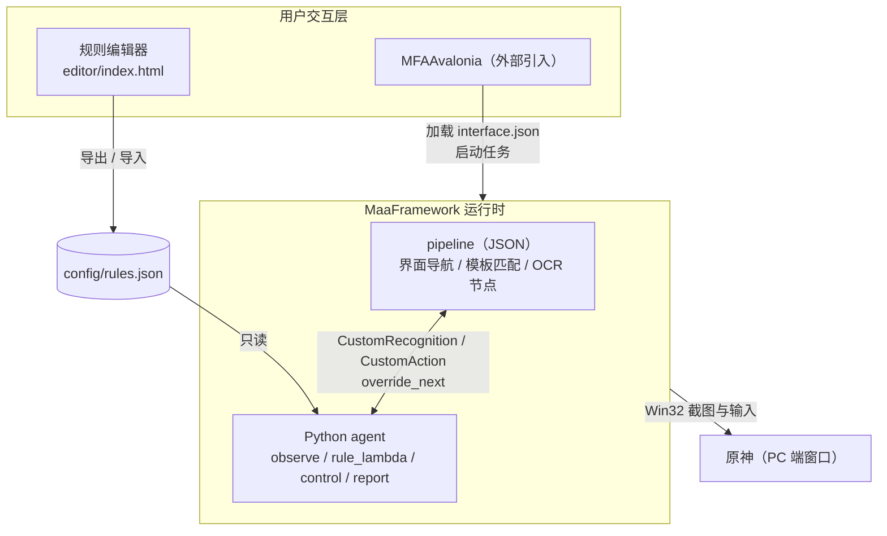
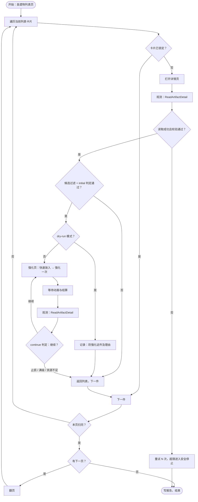

# Auto-Grade-Up 设计文档

- 日期：2026-08-28
- 状态：已与需求方逐节评审通过
- 方法：brainstorming（architectural 路径）

## 0. 已确认的需求决策

| 决策点 | 结论 |
| --- | --- |
| 工作流范围 | 全自动批量强化：扫描圣遗物背包，逐件读取、决策、强化，直到扫完或资源耗尽 |
| 运行平台 | PC 端原神，Win32 窗口控制 |
| 强化策略 | 逐回合判定：每次强化点击后回读属性再判定，支持止损；接受快速放入的跳级粒度 |
| 规则编辑 | 独立规则编辑器 GUI（单文件本地网页），规则保存为 JSON，支持导入导出 |
| 与 MFA 的关系 | MFAAvalonia 不支持自定义页面/插件（调研结论，见 §9），运行器直接复用 MFAAvalonia，编辑器通过规则 JSON 文件与其解耦 |
| 规则存储结构 | 结构化条件树（AND/OR 组 + 叶子条件），存储即 JSON |
| 狗粮来源 | 游戏内「快速放入」，护栏仅靠游戏锁定机制 + 升级/摩拉校验，明确不做狗粮星级校验 |
| 候选范围 | 可配置过滤，默认仅未锁定且未满级；默认星级 [5] |
| 扫描前提 | 用户预先在游戏内设置筛选「未满级」并按等级升序排序，工具不操作筛选 UI |
| 规则可引用字段 | 完整字段：部位、星级、套装、等级、主词条、全部副词条 |
| 运行记录 | 日志 + 结构化报告（JSON + Markdown 摘要） |
| 试运行 | 第一版即提供 dry-run：只扫描与决策，不实际消耗 |

## 1. 概述

Auto-Grade-Up 是一个基于 [MaaFramework](https://github.com/MaaXYZ/MaaFramework) 的原神圣遗物自动强化工具。它遍历游戏内圣遗物背包，用 OCR 读取每件圣遗物的完整属性，按用户自定义规则（结构化条件树）决定是否强化、是否继续强化，并通过模拟点击完成整个强化流程。

**非目标**（明确不做）：

- 圣遗物弃置、出售等不可逆清理操作（狗粮消耗除外，且由游戏锁定机制保护）。
- 圣遗物配装建议、评分排行。
- 移动端 / 云原神。
- v1 不做多语言界面（仅中文）。

## 2. 总体架构



| 组件 | 位置 | 职责 |
| --- | --- | --- |
| 运行器 | MFAAvalonia（外部） | 连接游戏窗口、启动任务、展示日志 |
| 导航流水线 | `assets/resource/pipeline/` | 界面状态机：模板匹配找按钮、OCR 定位、等待动画 |
| 观测机构 | `agent/observe.py` | 截图上多 ROI OCR，输出结构化圣遗物对象 |
| 决策机构 | `agent/rule_lambda/` | 加载校验规则文件、条件树求值、输出决策与可解释 trace |
| 执行机构 | `agent/control.py` + pipeline | 批量遍历总控、狗粮放入、强化点击、指纹复校 |
| 报告 | `agent/report.py` | 汇总运行记录，输出 JSON + Markdown |
| 规则编辑器 | `editor/index.html` | 条件树可视化编辑，读写规则 JSON |

依赖方向单向：`control → rule_lambda →（数据模型）`，`observe →（数据模型）`。决策与观测互不依赖，`rule_lambda` 与数据模型不 import `maa` 包，可在无 MaaFramework 环境下独立单元测试。

## 3. 圣遗物数据模型

观测机构的输出、决策机构的输入，唯一数据模型如下：

```jsonc
{
  "slot": "时之沙",            // 生之花 / 死之羽 / 时之沙 / 空之杯 / 理之冠
  "rarity": 5,
  "set": "辰砂往生录",
  "level": 4,                  // 0..20
  "locked": false,
  "main": { "name": "攻击力", "value": 31.5, "percent": true },
  "substats": [
    { "name": "暴击率", "value": 5.8, "percent": false },
    { "name": "攻击力", "value": 117, "percent": false }
  ]
}
```

解析约定：

- 词条名统一去除空白后作为键（OCR 可能引入空格差异）。
- `percent` 由游戏显示值的后缀 `%` 判定；同名词条（如「攻击力」）按显示单位比较，v1 不提供单位切换字段。
- 主词条「生命值/攻击力/防御力/元素充能效率/暴击率/暴击伤害/元素精通/治疗加成/伤害加成类」均按显示值比较。

## 4. 规则文件（config/rules.json）

规则文件是编辑器、决策机构之间的唯一契约。完整示例：

```jsonc
{
  "version": 1,
  "name": "默认双爆规则",
  "candidates": {
    "rarity": [5],             // 默认仅 5 星（防呆）；[] 表示不限
    "slots": [],               // 空 = 不限；如 ["时之沙"]
    "max_level": 20,           // 仅处理 level < max_level 的圣遗物
    "respect_lock": true       // 锁定件绝不处理
  },
  "initial": {                 // 初始判定：决定是否对这件圣遗物开始强化
    "condition": {
      "all": [
        { "field": "sub.暴击率", "op": ">=", "value": 8 },
        { "any": [
          { "field": "sub.暴击伤害", "op": ">=", "value": 15 },
          { "field": "sub.元素充能效率", "op": ">=", "value": 10 }
        ] }
      ]
    }
  },
  "continue": {                // 逐级判定：每次强化后决定是否继续
    "condition": {
      "all": [
        { "field": "level", "op": "<", "value": 20 },
        { "any": [
          { "field": "sub.暴击伤害", "op": ">=", "value": 20 },
          { "field": "sub.暴击率", "op": ">=", "value": 12 }
        ] }
      ]
    }
  },
  "fodder": {
    "strategy": "quick_fill",  // v1 仅支持游戏「快速放入」
    "respect_lock": true       // 声明性字段，游戏机制天然保证，编辑器不开放修改
  }
}
```

条件树结构：

| 节点 | 结构 | 语义 |
| --- | --- | --- |
| `all` | `{"all": [子节点...]}` | 所有子节点为真才为真；空数组视为真 |
| `any` | `{"any": [子节点...]}` | 任一子节点为真即为真；空数组视为假 |
| 叶子 | `{"field", "op", "value"}` 或 `{"field", "op": "exists"}` | 单条件 |

叶子运算符：`> < >= <= == != exists`（`exists` 判断该字段是否存在，如「有暴击率副词条」）。

字段命名空间：

| 字段 | 类型 | 说明 |
| --- | --- | --- |
| `level` | number | 当前等级 |
| `rarity` | number | 星级 |
| `slot` | string | 部位 |
| `set` | string | 套装名 |
| `main.<词条名>` | number | 主词条数值（显示单位） |
| `sub.<词条名>` | number | 副词条数值（显示单位），不存在时数值比较一律为假，可用 `exists` 显式判断 |

版本与校验：`version` 字段标识 schema 版本；编辑器与 `rule_lambda` 各自内置同一份 schema 常量做校验，解析或校验失败一律立即停止任务并提示（不回退到默认规则，避免用错误规则执行消耗性操作）。词条名枚举常量定义在 `rule_lambda` 中，编辑器内嵌同源副本，一致性由 schema 校验兜底。

**待定决策（M1 前专项讨论定案）**：条件树的字段类型系统与运算符集合——包括是否补充 `substat_count`（副词条条数）等字段、字符串字段（slot/set）的运算符限制与 `contains` 的取舍、`initial`/`continue` 外层 `condition` 包装层的去留。2026-08-28 评审决定延后至专项讨论，定案后更新本节并同步编辑器 schema。

## 5. 决策机构（agent/rule_lambda）

纯 Python 库，不依赖 MaaFramework：

- `model.py`：数据模型与 OCR 文本解析。
- `schema.py`：规则文件校验（结构、字段名、运算符合法性）。
- `evaluate.py`：条件树求值，返回 `(bool, trace)`。trace 记录每个节点的求值结果与命中详情，写入运行报告，保证每个决策可解释（「为什么强化」「为什么止损」）。

求值语义：字段缺失时数值比较为假、`exists` 可用；`level/rarity` 等标量字段始终存在。

## 6. 观测机构（agent/observe.py）

一个 CustomRecognition（`ReadArtifactDetail`）：单次截图，多个 ROI 并行识别，产出 Artifact 与逐字段置信度。

| ROI 区域 | 内容 | 手段 |
| --- | --- | --- |
| 左上标题区 | 套装名、部位 | OCR |
| 左栏主词条区 | 主词条名 + 数值 | OCR |
| 等级区 | 当前等级 | OCR / 模板数字，ROI 在 M2 标定时确定 |
| 右栏副词条列表 | 逐行「词条名+数值」 | OCR |
| 星标区 | 星级 | 星星图标模板匹配（1~5 档） |
| 锁定标记 | 是否锁定 | 锁定图标模板匹配 |

可靠性设计：

- 完整性校验不过（副词条行数与等级不符、等级/星级解析失败、必填字段缺失）→ 返回失败，上层进入安全分支，绝不带着残缺数据做消耗性决策。
- 所有 OCR 原文与调试截图落盘到 `debug/`（已在 .gitignore），便于精度排查。
- 小字号数字识别不达标时，升级方案为更换 PP-OCRv6 更大档 rec 模型或对数字区域做放大预处理。

ROI 一律在 720 短边坐标系标定，使用 VSCode 的 Maa Pipeline Support 插件截图取点。

## 7. 执行机构与批量状态机



驱动方式（混合方案）：单件强化循环（强化 → 结算 → 回读 → 判定）由 pipeline 状态机表达，享受模板匹配的等待与重试机制；批量遍历（翻页、选下一件、终止）由 `agent/control.py` 的总控 CustomAction 驱动，两者以 `override_next` 粘合。

界面入口与扫描约定：

- **使用前提（v1 强制）**：用户预先在圣遗物列表页设置游戏自带筛选「未满级」，并按「等级升序」排序——前者把满级件排除出扫描范围，后者让升级成本低的件先被处理。工具不操作游戏筛选 UI。
- 启动自检：批量任务要求当前处于圣遗物列表页，单件任务要求处于圣遗物详情页；界面特征不符则立即停止并提示，不做自动导航。
- 列表页卡片模板匹配锁定图标，锁定件跳过详情页。

狗粮策略（v1）：

- 详情页进入强化页后点击游戏「快速放入」，由游戏按自身逻辑选择狗粮；锁定件被游戏机制天然排除。
- 「把不想喂的圣遗物提前锁定」作为安全提示写入使用文档。
- 明确不做狗粮星级校验（2026-08-28 评审决策）；强化前仅校验「预计可升 1 级 + 摩拉充足」。
- 单次强化可能因经验溢出跳多级，规则语义为逐回合判定（见 CONTEXT.md）；文档明示该粒度，报告如实记录每回合的等级跨度。
- 工具控狗粮筛选（星级范围）作为后续增强，待实测游戏筛选行为后接入。

安全红线：

- 一切消耗性操作（点「强化」）之前，用「套装+部位+等级」指纹复校当前详情页与决策对象是同一件，不一致立即停止。
- 摩拉不足（强化按钮不可用）→ 整体停止并写报告；狗粮经验不足以升下一级 → 跳过该件继续下一件。
- 弃置、出售类不可逆操作不在功能范围内。

## 8. 规则编辑器（editor/index.html）

单文件本地网页，零依赖、离线可用，双击浏览器打开即用。原生 HTML + CSS + JavaScript，不引入构建链。

功能清单：

- 条件树可视化编辑：添加 / 删除 / 嵌套 `all`-`any`-叶子节点，叶子提供字段下拉（含 `main.*` / `sub.*` 词条枚举）、运算符下拉、阈值输入。
- 候选过滤与狗粮配置表单。
- 导入 / 导出 rules.json（拖拽导入 + 文件选择）。
- 内置 schema 校验，非法配置给出定位到节点的错误提示。
- 当前规则的人类可读预览文本（用于确认规则语义）。
- 中文界面。

schema 常量与 `rule_lambda/schema.py` 保持同源（复制维护），一致性由双端校验与单测中的用例互换兜底。

## 9. interface.json 与 MFAAvalonia

MFAAvalonia 调研结论（2026-08）：它是纯声明式 UI，渲染 interface.json 里的任务与选项（select / checkbox / input / hotkey / switch），**没有插件系统、自定义页面或内嵌 WebView**，无法承载规则编辑器；fork 成本不成比例。故采用「编辑器独立、规则文件解耦」：

- 运行器：直接使用 MFAAvalonia，本项目只维护 interface.json 与资源包。
- 规则传递：interface.json 提供 `input` 类型选项「规则文件路径」（带正则校验），值经 `pipeline_override` 的 `{名称}` 模板替换注入任务入口节点的 `custom_action_param` / `custom_recognition_param`（协议确认这两个字段为任意类型）；未填时 agent 使用默认路径 `config/rules.json`（相对 interface.json 目录，该目录已被 .gitignore 排除）。
- 其余选项：「摩拉下限」（input，低于即停）、「狗粮策略」（select，v1 仅 quick_fill）。

controller：Win32，`window_regex: "原神|Genshin"`；截图与输入方式（PrintWindow / PostMessage 系 / Seize）按 MaaFW 控制方式文档真机实测选定。资源包 v1 仅官服一份。发布物（README 与使用文档）需包含模拟输入类工具的账号风险免责声明。

## 10. 报告与试运行

每次运行在 `logs/` 产出：

- `report-<时间戳>.json`：结构化全量记录。
- `report-<时间戳>.md`：人类可读摘要（处理件数、强化件数、消耗、异常）。

JSON 结构（示意）：

```jsonc
{
  "dry_run": false,
  "rules_name": "默认双爆规则",
  "artifacts": [
    {
      "before": { },            // Artifact 快照
      "after": { },
      "levels_gained": 12,
      "rolls": [ { "level": 8, "new_or_upgraded": ["暴击伤害 +6.2%"] } ],
      "decisions": [
        { "at_level": 4, "action": "enhance", "trace": { } }  // rule_lambda 求值 trace
      ]
    }
  ],
  "summary": { "scanned": 87, "enhanced": 9, "stopped_reason": "mora_exhausted" }
}
```

dry-run 复用同一扫描与判定代码路径，仅在 initial 判定通过后记录「将强化这件及理由」，不进入强化页、不消耗任何资源，报告中 `dry_run: true`。

## 11. 错误处理与安全红线

| 场景 | 行为 |
| --- | --- |
| OCR 读取失败 / 校验不过 | 重试 N 次（默认 3，常量可调，含重新打开详情页），超限进入安全停止 |
| 界面卡住 / 等待超时 | pipeline 节点超时兜底 + 总控检测，安全停止 |
| 常见弹窗（升级提示、网络异常） | 兜底节点识别并关闭后恢复流程，无法识别则停止 |
| 指纹复校不一致 | 立即停止，报告中标注中断点 |
| 规则文件缺失 / 校验失败 | 不启动任何消耗性操作，直接报错 |
| 识别置信度低但可用 | 记入报告 warning，继续执行 |

原则：宁可停止报告，绝不盲点消耗性按钮。

## 12. 测试策略

- `rule_lambda` + 数据模型：pytest 纯单测（条件树求值、缺字段语义、schema 校验、OCR 文本解析），全程不 import `maa`。
- 编辑器：schema 用例与 `rule_lambda` 侧互换验证（同一批合法/非法样例双端跑）。
- 观测机构：真实游戏截图样本存 `test/fixtures`，离线回放跑 OCR 解析断言。
- 端到端：真机 dry-run + 小规模真实强化人工验收。

## 13. 目录结构（新增部分）

```
agent/
  main.py            # 已有：agent 入口
  observe.py         # 观测机构
  control.py         # 批量总控 CustomAction
  report.py          # 报告生成
  rule_lambda/       # 决策机构（纯库）
    model.py
    schema.py
    evaluate.py
assets/resource/pipeline/genshin/   # 导航流水线（按界面拆分 json）
assets/resource/image/genshin/      # 模板图
editor/index.html                   # 规则编辑器（单文件）
docs/examples/rules.example.json    # 示例规则
test/                               # 单测与截图 fixtures
```

`config/`（用户规则）、`logs/`、`debug/` 均不入库。

## 14. 里程碑

| 里程碑 | 内容 | 验收标准 |
| --- | --- | --- |
| M1 | 数据模型 + rule_lambda + schema + 单测；示例规则 | pytest 全绿；示例规则双端（编辑器/agent）校验一致 |
| M2 | 观测机构离线打通 | fixtures 截图回放，字段解析断言全过 |
| M3 | 单件强化循环真机联调 | 真机上对一件圣遗物完成「读取→判定→强化→回读→止损」闭环 |
| M4 | 批量遍历 + 启动自检 + 报告 + dry-run | dry-run 扫描出正确候选清单；真实运行产出完整报告 |
| M5 | 编辑器完善 + MFAAvalonia 打包发布 | 编辑器可用；MFA 加载 interface.json 完成一次批量任务 |

M3 是最大不确定性所在（界面时序、输入方式、OCR 精度），故安排在批量功能之前。

## 15. 风险与待验证项

| 风险 | 影响 | 预案 |
| --- | --- | --- |
| 原神对后台消息输入（PostMessage 系）的支持未知 | 可能无法后台操作 | 真机实测各输入方式；退到 Seize 前台模式并在文档写明使用条件 |
| OCR 对小字号数字（+ 号、% 后缀）精度不足 | 属性读取错误 → 错误决策 | 更大档 rec 模型、数字区域放大预处理、debug 截图人工核对 |
| 「快速放入」的狗粮挑选行为与预期不符 | 误喂有价值圣遗物 | v1 依赖锁定机制 + 文档强提示；工具控筛选提前到 M4 验证 |
| 游戏分辨率/长宽比差异（假定 16:9） | ROI 全部偏移 | 文档约定 16:9；后续按需支持其他比例 |
| 游戏版本更新导致界面变动 | 模板图/ROI 失效 | 按界面拆分 pipeline 文件，降低维护面；报告中的截图辅助定位 |
| 强化动画时序波动 | 流程中断 | 等待结算模板 + 超时轮询详情页稳定帧，禁用固定 sleep 作为唯一手段 |
| 条件树字段类型与运算符集未定案 | M1 无法开工 | 专项讨论定案后写入 §4 并同步编辑器 schema，M1 前完成（2026-08-28 评审延后） |
